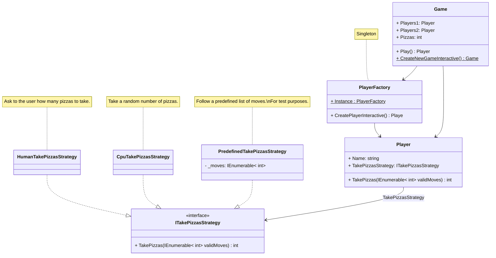

# PizzaGame
## Run
```bash
dotnet run --project PizzaGame
```
## Test
```bash
dotnet test Test
```
## Class Diagram


```mermaid
classDiagram
class Player{
    + Name: string
    + TakePizzasStrategy: ITakePizzasStrategy
    + TakePizzas(IEnumerable< int> validMoves) int
}
class ITakePizzasStrategy  {
    <<interface>>
    + TakePizzas(IEnumerable< int> validMoves) int
}
class HumanTakePizzasStrategy
class CpuTakePizzasStrategy
class PredefinedTakePizzasStrategy{
    - _moves: IEnumerable< int>
}
HumanTakePizzasStrategy ..|> ITakePizzasStrategy
CpuTakePizzasStrategy ..|> ITakePizzasStrategy
PredefinedTakePizzasStrategy ..|> ITakePizzasStrategy
Player --> ITakePizzasStrategy:TakePizzasStrategy
class PlayerFactory{
    + Instance : PlayerFactory$
    + CreatePlayerInteractive() Playe
}
note for PlayerFactory "Singleton"
PlayerFactory --> Player
class Game{
    + Players1: Player
    + Players2: Player
    + Pizzas: int
    + Play() Player
    + CreateNewGameInteractive() Game$
}
Game --> Player
Game --> PlayerFactory
note for HumanTakePizzasStrategy "Ask to the user how many pizzas to take."
note for CpuTakePizzasStrategy "Take a random number of pizzas."
note for PredefinedTakePizzasStrategy "Follow a predefined list of moves.\nFor test purposes."
```